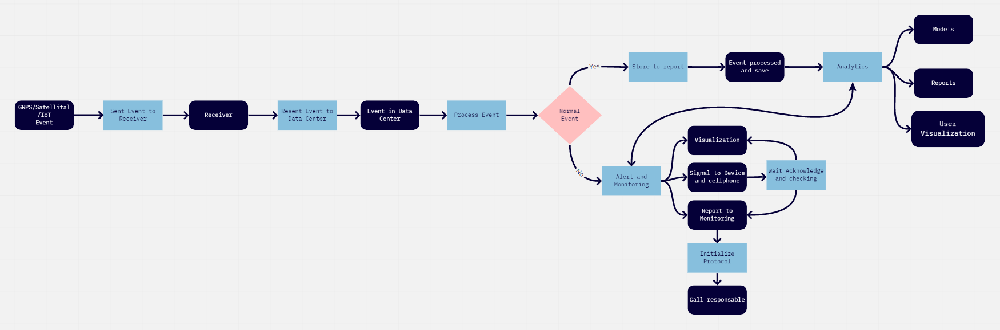

# Building a Big Data architecture in the cloud (Workshop)

Repository for a workshop to build an architecture in cloud with AWS EMR and Spark.

We will create and architecture to obtain and process some events or records in a Big Data environment in cloud (AWS  in this case).

Requirements: 

Amazon AWS account: https://aws.amazon.com/

Python 3.6 or higher:  https://www.python.org/downloads/release/python-360/ or https://www.anaconda.com/

Spark 2.4.5 or higher: https://spark.apache.org/docs/2.4.5/

Putty or other SSH connector: https://www.putty.org/

SFTP connector program such as Cyberduck: https://cyberduck.io/

Steps.

1. **Understanding the problem:**

   A company works with event monitoring devices that detect certain signals such as gas leaks or signals from a vehicle or any IoT signal or positions of an employee or an object or they can also be confirmations of activities that have been done.
   This process is carried out in real time but it can also have an alternative process in which it receives all the events in batch to be processed and after being classified, they can be stored together with the events that arrive in real time. The final result can be to be viewed in a web application.

   An example of the complete process is drawn below:

2. **Process:**

   a. Analyze the functionalities.

   b. Analyze the quality attributes, for example in this case: Is very important to follow a stream process with low latency, good reliability and availability. However, other attributes like usability or interoperability maybe can be good drivers of our architecture. 

   (To understand this attributes and the process to create the drivers you can read: [Software Architecture & Quality Attributes](https://sites.google.com/site/misresearch000/home/software-architecture-quality-attributes#:~:text=There%20are%20three%20main%20categories,%2C%20testability%2C%20usability%2C%20others.&text=Architectural%20Qualities%3A%20conceptual%20integrity%2C%20correctness%20and%20completeness.))

   c. Write the non-functionalities requirements. 

   d.  Determinate the  enterprise environment, for example the components in your company are on-premise or there are in a private cloud or in a different cloud that you know. It is important to analyze cost, efforts and the disposition to make any change. 

   e. Fit the "LEGO pieces"

3. **Purpose of draw of architecture:** (This is just one of the many possible approaches)

   

4. **Demo:**

   Now to implement this architecture in AWS, we could simplify or divide the development process:

   First, we could develop the batch processes because this help to understand the data and the results, after that we could focus the streaming process and finally in the integration of all process.

   

    

   

   **4.1 Users and credentials:**

   To begin, it's necessary to create an AWS user and credentials, this is the simple way to access cloud services from a remote location, however, the final and correct way suggested is through roles.

   The administrative services to create users is IAM: https://docs.aws.amazon.com/IAM/latest/UserGuide/id_users_create.html

   And the easiest way is using the AWS console (web page).

   It's very important to keep save the AWS Access Key ID and the Secret Access Key because it is the way to control your services in cloud.

   

   

   

   Optionally we can create a connection between the local computer and the AWS user with AWS CLI: https://aws.amazon.com/cli/

   The command to configure this parameters is: *aws configure*

   

    

​			**4.2. Source:** 

There is a lot of possible sources of the data,  in fact is well-knowing that one of the features of Big Data is the variety of data sources. In the case of 	this demo the source could be IoT sources, however to keep simple the process we will suppose that the data is structured and is stored in [S3 services.](https://aws.amazon.com/es/s3/) 

The file that we use is in the data folder: [Events](data\Events.csv)

 Un example of a possible list of events:

 <u>Regular:</u>

- Time report=1
- Check In=2

<u>Alerts:</u>

- Worker Fall=3
- Missed check-In=4
- No motion=5
- SOS alert=6
- High gas alert=7
- Low gas detected=8

<u>Structure:</u>

- Worker ID
- Worker Name
- Event
- EventTime
- Latitude
- Longitude

After store the data in S3 we will have a "folder" as a source.  You need to decide the name and the path of the bucket, folder and file. 

 

**4.3 Process and storage**

To process the data we could use many services. In this case we will use Spark and the best services in AWS to use Spark is in [AWS EMR](https://aws.amazon.com/emr/) 

EMR is a service that have internal services running in virtual machines in [EC2](https://aws.amazon.com/es/ec2/). Those services most belong to Big Data environment with Apache licenses like: 

To access this services is necessary to create a channel using SSH. To do this connection we have many tools and one of these is [Putty](https://www.putty.org/) using this guide: 

https://docs.aws.amazon.com/emr/latest/ManagementGuide/emr-connect-master-node-ssh.html

Additional to access some user interfaces in some services in the EMR cluster is necessary configure tunneling through a local proxy following these instructions: https://docs.aws.amazon.com/emr/latest/ManagementGuide/emr-connect-master-node-proxy.html

In this demo we just need to read the data from the S3 folder and make some transformation, like filters, however in real enterprise environments Spark is an excellent framework to analyze data in batch or streaming and to create Machine Learning solutions. 

We could divide the information from the source in Events (Records type 1, 2) and Alarms (other cases) and send this to different receptors like tables in a service layer like [DynamoDB](https://aws.amazon.com/dynamodb/).

- We will create two tables: blsEvents, blsAlarms with key: Device_id and sort_key: EventTime. Both tables have the same structure however the records will be different. 

[However](), to send the data outside the EMR cluster, especially to DynamoDB, we need to create a bridge, a temporal repository in a storage services inside the cluster like Hive. 

To make this filter and send the results we will use the script: [read_csv.py](scripts\read_csv.py)

To do this we can submit a job in spark in two ways:

a. Open a Spark session in the cluster using the next command:  

*pyspark --executor-memory 512m --jars /usr/share/aws/emr/ddb/lib/emr-ddb-hive.jar,/usr/share/aws/emr/ddb/lib/emr-ddb-hadoop.jar*

Next, we can send line by line of the script to obtain the result. 

b. Submit directly the complete file to spark jobs:

*spark-submit  --deploy-mode cluster --executor-memory 512m --jars /usr/share/aws/emr/ddb/lib/emr-ddb-hive.jar,/usr/share/aws/emr/ddb/lib/emr-ddb-hadoop.jar read_csv.py*

**4.4. Visualization** 

As result of this operation we could have the information in a service layer and this could be consumed through APIs, as a channel to show the information for instance in a web page. 

An example of an API with GraphQL or REST is in this route. [API](BLSAPP\BLSAPP) . In this case is important to configure the AWS credential, 

An example of a web page consuming the API is in this route. [Web](BLSAPP\BLSWeb) In this case is important to configure the path to the API and Google Maps Credential

5. **Streaming**

   The real problem could be more complex if we have a source in streaming, due, this kind of process need a continues consumer of the data and a real time processing and storage.

   In this case we can use a Kafka cluster to receive the data and a Spark Streaming process to analyze and transform the data and send to a storage or server layer. 

   In AWS the Kafka services could be configured with EC2 instances,  or we could use a PaaS named Kinesis that is used pretty similar to Kafka.

   A producer to simulate the produce of the data in Kinesis is in the path: [Producer Kinesis](scripts\kinesis Boto.py)

   A consumer of this in Spark Streaming is in the path: [Consumer Kinesis](Scripts\SparkStreaming.py)

   The result will be storage in DynamoDB and could be consumed finally through the same API and webpage.

